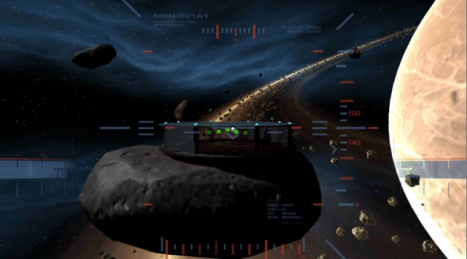

# udnd_04_puzzle
udnd Puzzler for project 4 in Udacity VR course - September 2017

## Documentation
Documentation is included in the [docs](docs) folder.

## Project Contents
Quick description of contents within this repo.

* Assets - assets including GoogleVR SDK clips for project
* ProjectSettings - project settings for builds
* .gitignore - ignore file based on Unity footprint
* build.zip - compressed build for Android
* LICENSE - current license
* README.md - this file
* Walkthrough/ - examples of screenshots and solutions to puzzles

### Customizations
* Space theme - skybox, asteroids, ship assets
* Asteroid field - randomized asteroid field passing around the main station during gameplay to add some dynamics to the gameplay
* themed sounds - picked up a few sound effects to add to the interactions

### Comments
Struggles:
* **GVR setup** - Initializing a GVR scene was solved with [forum help](https://discussions.udacity.com/t/reticle-is-not-showing/203621/27)
* **World/local coordinate normalization** - Working with intermediate objects like spheres and planes (instead of pre-created meshes) meant that the objects could be transformed within the editor.  However, this results in odd values for the rotation, scale, etc. of the object and makes nesting its children (in the editor hierarchy) more challenging.  In the end, I used lots of empty place holders for objects.
* **iTween** - A number of great demos for iTween manipulation can be found on [this wiki page](https://unionassets.com/blog/basic-animation-itween-259).
* **Flickering Lights** - In original game design, I wanted to include multiple stages of the game, including one where internal lights were flickering.  After reviewing some of the *don't do* options for motion sickness, I backed off of this strategy.

## Requirements
Software and build environment requirements.

* [Unity 2017.1.0p4](https://unity3d.com/get-unity/download/archive)
* [GVR Unity SDK v1.70.0](https://github.com/googlevr/gvr-unity-sdk/releases/tag/v1.70.0)
* Course starter materials
* Android KitKat 4.4 or later

### Extra Assets
A few extra assets were used in the creation of this project.  A best effort attempt includes the original source for this content and associated *free* AssetStore Assets (placed in the [MarketExtra](Assets/MarketExtra) folder).
* [SCI-FI Barrels 40 Sample](https://www.assetstore.unity3d.com/en/#!/content/92986)
* [Future Beeps LITE EDITION](https://www.assetstore.unity3d.com/en/#!/content/63357)
* [Skybox Volume 2 (Nebula)](https://www.assetstore.unity3d.com/en/#!/content/3392)
* [Equipment for Industrial or Sci-Fi Building](https://www.assetstore.unity3d.com/en/#!/content/82846)
* [Space Asteroids](https://www.assetstore.unity3d.com/en/#!/content/96444)
* [iTween](https://www.assetstore.unity3d.com/en/#!/content/84)
* visual assets - [HUD display](https://disastranagant.deviantart.com/art/Delta-Plus-HUD-272423043), [robot font](http://www.dailyfreefonts.com/fonts/info/38-DS-Digital.html), 
* various space audio - [door close](http://soundbible.com/1288-Chamber-Decompressing.html), [breathing](http://soundbible.com/143-Astronaut-Breathing.html), [power-up](http://soundbible.com/1636-Power-Up-Ray.html)
* various ambient audio tracks - [game start](https://soundcloud.com/astropilot/space-ambient-demo-00), [within puzzle](https://soundcloud.com/time-space/alteredreality-demo2), [puzzle solution](https://soundcloud.com/brillbilly/lost-in-space-ambient)
