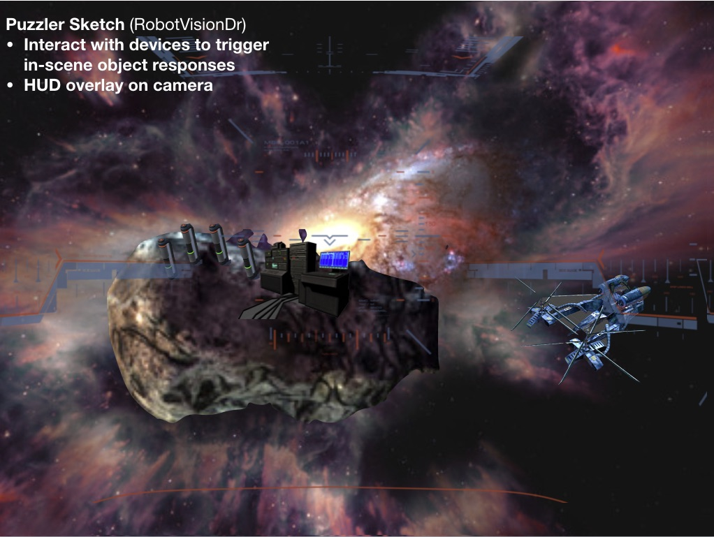

Statement of Purpose
===
Puzzler is a mobile VR application for new VR users which challenges them to solve a familiar type of puzzle in a new way.

Personas
=== 

Jill
---
* Occupation: Network Engineer
* Age: late 40's
* Quote: "I enjoyed updating my skills and am eager to show how automation can help!"
* Description: Jill is in her mid to late career but hopes to reboot her career in the world of machine learning and automation after taking a MOOC course about machine learning.  Over a period of two years, she took three courses after-work to complete a masters degree through distance learning.  She's done the work, followed the lessons, and is eager to immediately apply what she learned to her real job -- and reap the rewards for doing so.
* Experience with VR: None
* [link to this quiz post](https://discussions.udacity.com/t/quiz-responses-create-a-persona-for-puzzler/203143/220?u=robotvisiondr)
* (stock photo example from pexels.com) 

Sketch
===
* Theme: Space + launch
* Interactions: Sets of “space” canister objects (will light with different colors)
  * Possibly using SFX and speech/spoken text for more intuitive responses; want to avoid text/reading if possible
* Triggers: Various objects in space (within frontal viewing area) will begin to respond and take off
* Assets: All assets here are collected from free resources on Unity store
* [link to this quiz post](https://discussions.udacity.com/t/quiz-responses-sketch-and-post-on-the-forum/203148/182?u=robotvisiondr)

Resources
===
* [HUD display](https://disastranagant.deviantart.com/art/Delta-Plus-HUD-272423043)

