Statement of Purpose
===
Puzzler is a mobile VR application for new VR users which challenges them to solve a familiar type of puzzle in a new way.

### Table of Contents
1. [Introduction to the application](#Introduction)
   1. [Personas](#Personas)
2. [Creating the Puzzler](#Creating-the-Puzzler)
   1. [Background](#Background)
   2. [Interactions](#Interactions)
      1. [Gameplay](#Gameplay)
      2. [Dialogs](#Dialogs)
3. [User testing for project status](#User-testing)
4. [Final walkthrough](#Final-Walkthrough)
5. [Conclusion](#Conclusion)

# Introduction
This puzzle game will be focused on a space theme with a small mix of logic games.  Adhering to suggestions about focus zones, the game will place most active objects directly in front of (or immediately to the side of) the user's primary view.  Each puzzle should require only a few seconds
to complete and must pass the "kid" test for both retaining attention and complexity.

## Personas
This game is focused on beginners to VR for interaction and mechanics complexity, but it should also contain a light mix of challenge.  Putting the question of mass adoption aside, an initial user base is aimed at younger children or early-VR adults that are looking to get some exposure to a few puzzles in a non-nausea educing fashion.

### Jane
* Occupation: Stay at home parent, [pexels.com image source](https://www.pexels.com/photo/boy-child-childhood-happiness-235554/)
* Age: mid 30's
* Quote: "I enjoy exploring new things and exposing my children to things that will better prepare them for the future"
* Description: Jame has an advanced degree in the humanities and has been a stay-at-home parent for about 6 years.  She's not an avid participant in social media but enjoys time with friends and participating in project creation with her two daughters.  While she's never been one to be near the bleeding edge of technology, she will try almost anything (like VR) with a nudge from an online article.
* Experience with VR: Very little, prior lengthy experiences caused mild nausea
* 

### Marshall
* Occupation: Child, [pexels.com image source](https://www.pexels.com/photo/boy-child-clouds-kid-346796/)
* Age: 6
* Quote: "I want to be an superhero when I grow up."
* Description: Marshall is a six-year old boy (Jane's son), who enjoys crafts, reads for at least two hours a day, and has a growing appreciation for graphic novels.  He only gets an hour of screen time a day, but he chooses how to use it well, from math-based games to YouTube videos about origami.
* Experience with VR: Little, only via mobile games
* 

### Jill
* Occupation: Network Engineer
* Age: late 40's
* Quote: "I enjoyed updating my skills and am eager to show how automation can help!"
* Description: Jill is in her mid to late career but hopes to reboot her career in the world of machine learning and automation after taking a MOOC course about machine learning.  Over a period of two years, she took three courses after-work to complete a masters degree through distance learning.  She's done the work, followed the lessons, and is eager to immediately apply what she learned to her real job -- and reap the rewards for doing so.
* Experience with VR: None
* [link to this quiz post](https://discussions.udacity.com/t/quiz-responses-create-a-persona-for-puzzler/203143/220?u=robotvisiondr), [pexels.com source](https://www.pexels.com/photo/adult-brainstorming-business-career-440588/)
* 

# Creating the Puzzler
This section includes discussion and initial sketches for the proposed game with a mix of graphics from online sites and assets from the game as it was developed.

## Background
* Theme: Space + launch
* Interactions: Sets of “space” canister objects (will light with different colors)
  * Possibly using SFX and speech/spoken text for more intuitive responses; want to avoid text/reading if possible
* Triggers: Various objects in space (within frontal viewing area) will begin to respond and take off
* Assets: All assets here are collected from free resources on Unity store
* [link to this quiz post](https://discussions.udacity.com/t/quiz-responses-sketch-and-post-on-the-forum/203148/182?u=robotvisiondr)
* 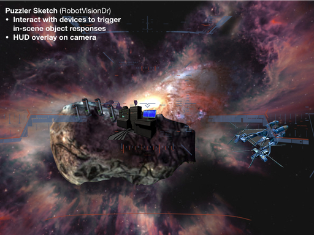

## Interactions
This section walks through proposed interactions of the game.

### Gameplay
* **Initial Environment** - initially proposed design, with a rich, exterior collection of puzzles and a nearby ship that would go through stages of activation during gameplay; this solution was reduced in scope due to implementation challenges and the desire to create different moods with an enclosed working area
  * 
* **Game 1** - initially proposed 1/3 puzzle - a button pushing puzzle that would stabilize lighting in the puzzle room
  * 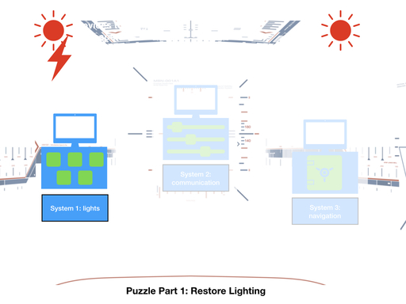
* **Game 2** - initially proposed 2/3 puzzle - this puzzle would emit sounds according to different slides that the player would match
  * 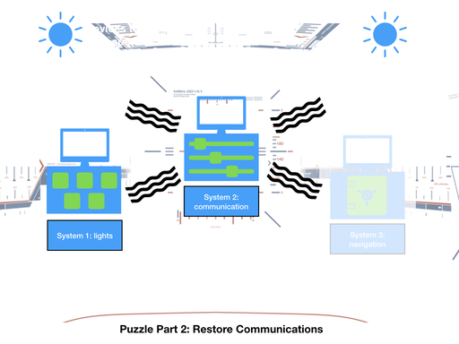
* **Game 3** - initially proposed 3/3 puzzle - upon completing this puzzle "navigation systems" would be restored and the ship floating outside of the room would resume function and take off
  * 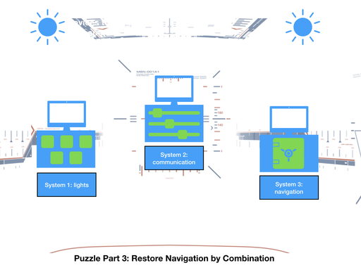

### Dialogs
Different combo box styles were evaluated with different button colors and positions on screen.  Ultimately, style 6 was chosen because of the contrast of the button but coherence with the blue visuals from the HUD graphic and the general skybox blue hues.  Originals for each style
are kept in the [dialog sketches](sketches/dialogs) directory.

* 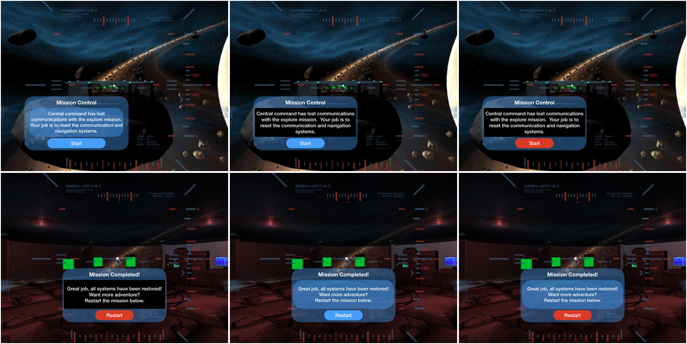

# User testing
## Initial Usability
These questions were prompted to the first test subject.  After experimentation and observations, a few insights were produced.
* Initial quesitions:
  * What do you see?
  * How do you interact with the system?
  * How does the size of objects feel?
  * How does it feel navigating?
  * Do you understand controls?
* Observations from this session were the following:
  * Some grammatical errors in the panel discussions
  * Hide the final success panel until the ship animation is completed
  * Slow movement to the final area
  * Some graphical errors in this testing session
  * Modulate the sounds of the environment (perhaps a little louder)
  * Switch fade transition from white to black
* Video of the experience...
  * 

## Final Usability
These questions were prompted to the first test subject upon game near completion.

* Initial questions:
  * Are the instructions clear on the panels?
  * Is the movement slow and smooth enough for you?
  * Do you see any graphical or other unusual errors for the experience?
  * Was the game long enough and/or satisfying to play?
  * Could you do everything you needed to while sitting in a chair?
  * If you could add one or more additional features for the game, what would they be?
* Suggestions from this this session were the following:
  * Instructions were mostly clear except that the random generator created a confusing pattern.
  * Movement speed was okay after changing approach speed.
  * No graphical errors were detected or observed, mild compliments on the content in the scene.
  * Yes, game was long enough with the caveat that the instructions weren't as clear.
  * No additional movement was required for playing the game from within a chair.
  * No additional features, except for the clearer instructions.  Could possible pointer or change it to indicator that computer is acting.
* Video of the experience:
  * 

# Final Walkthrough

* Video of the experience:
  * 
* introduction screen - Main visibility of the intro panel and the skybox, behind the
  immediate view is the enclosed puzzle area, which is positioned on a stationary asteriod
  and a space ship that is adrift to the right of the asteroid.  A nebulous and
  ambient music score is attached to this room.
  * 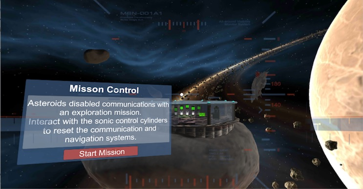
* rear environment - Although there was advice in the course to avoid rear views,
  some time was devoted to creating and experimenting with randomly created asteroids
  that would pass by the viewer (from rear along side to front).
  * 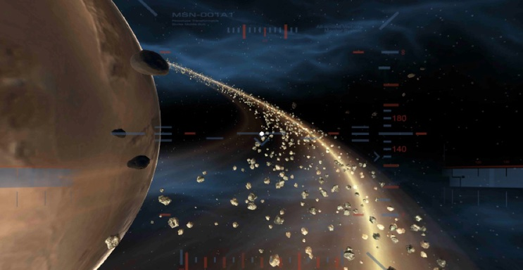
* inside puzzle room, rear - Immediately after the user enters the puzzle room, the glass
  door closes with a sound.  For environmental effect, a special font and the phrase
  "access locked" is displayed.  A somewhat suspenseful but also ambient musical score
  is associated to this room/stage in the puzzle.
  * 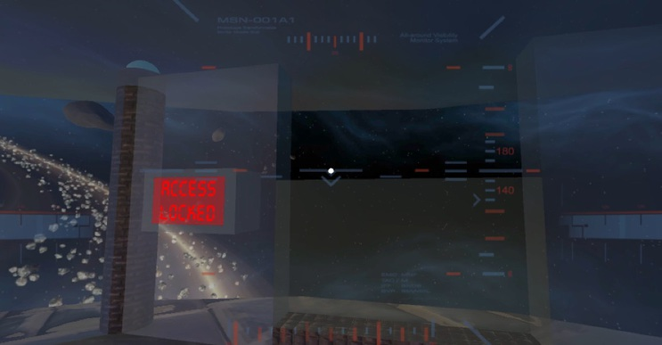
* computer in puzzle room - To the frontal right are a few computer props in the puzzle room.
  To keep the user interested, if clicked upon, three different parts of the computer will beep.
  As discussed in the design notes, originally these comptuer assets would have been the
  focus points for sub-puzzles, but due to time and complexity this route was not pursued.
  The second image here illustrates early testing (which was not kept) with a light
  flickering operation.
  * 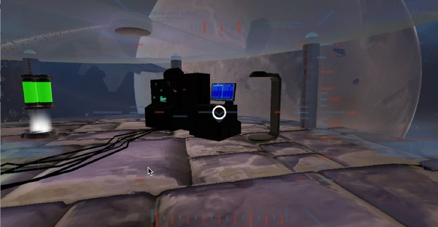
  * 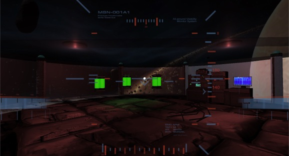
* barrels in puzzle room - Additional details within the puzzle room are a few barrel
  objects to the front left. These barells are static in color and position, but they
  were created to go along with the space equiptment motif.
  * 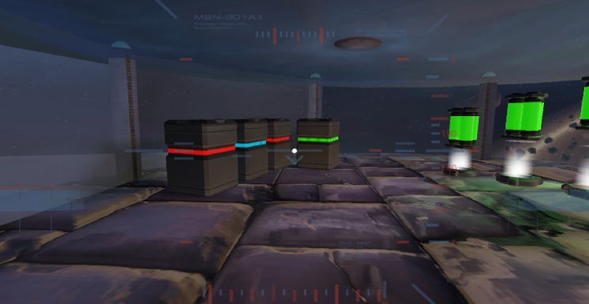
* puzzle room mood - The puzzle room is an enclosed structure, but has a glass-like
  wall and ceiling so that the player can enjoy the rest of the oustide environment
  effects.  Lighting in the room is a mix of two static blue and red lights for a soft,
  but pensive tone.
  * 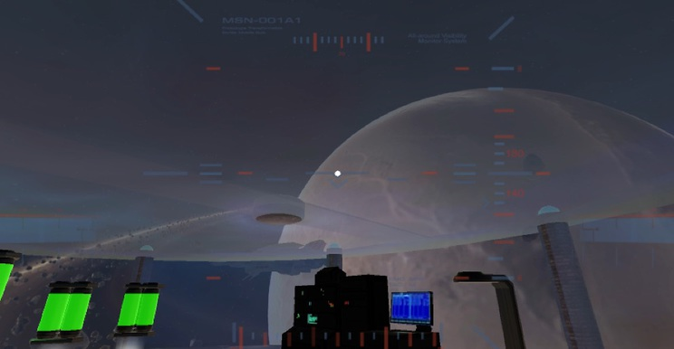
* puzzle orbs - Adapting from the template, the orbs here were modified to include glowing
  cylinders as the primary interaction components.  The normal state of the cylinders is
  green and slightly floating up and down.  When hovered over, the cylinder turns blue and
  emits a musical sound corresponding to its interaction.  
  * 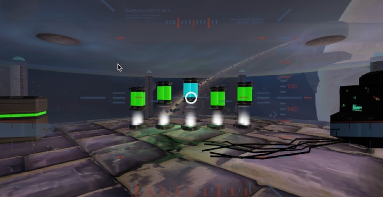
* puzzle error - When the player enteres the incorrect puzzle orb order, a voice will
  be played that says "Computer Malfunction" and the cylinders will all turn red.  Following
  course suggestions, interactions with the orb objects is temporarily disabled.
  * 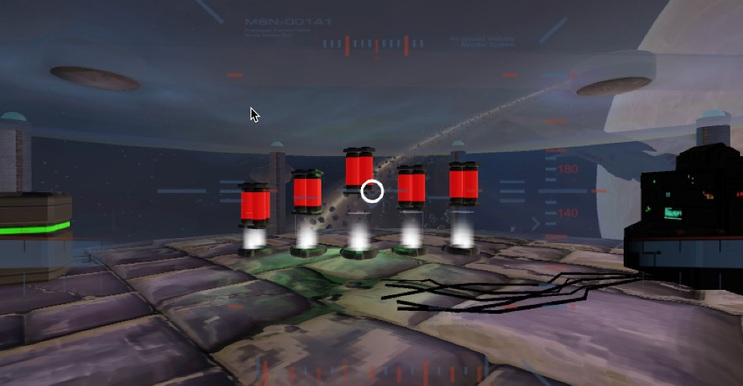
* puzzle resolution - When the user completes the puzzle, a simple particle animation is
  enabled and all parts of the cylinder (floating, base, white colored base) will disappear.
  More complex animations were experimented with, but the visual effect was not coherent
  enough to keep for user interaction.
  * 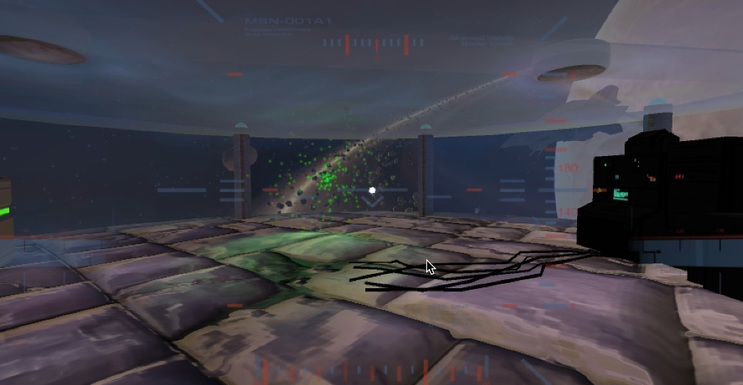
* ship animation - Also after puzzle completion, the player is moved to a "window" view of the
  ship from within the puzzle room.  The ship will correct its floating orientation and a
  particle trail (better seen in the video) will be activated as the ship navigates to a
  distant point on the horizon.
  * 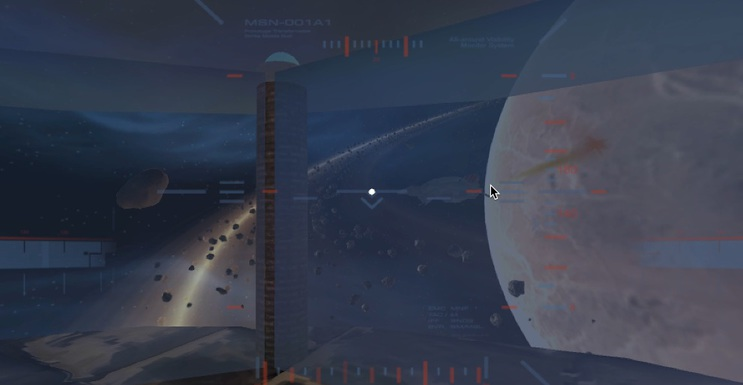
* game completion dialog - Finally, after the ship navigates away, the completion dialog will be show
  to the player.  Following the introduction style, this dialog has a short set of directions and
  an actionable button that will fade to black and reset all game play objects.
  * 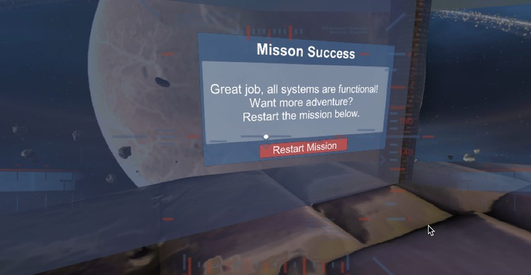

# Conclusion
The creation of this Puzzler app was fun and an informative way to explore a
design-oriented process for application creation and development.  By completing the
process, lessons on initial persona identification and tight user testing were
valuable and ultimately reduced the time to completion of the project by validating
proper development scope.

These lessons will be utilized in future game and project designs because they still
permit the addition of experimental techniques and learning but do so in a controlled
and ultimately _useful for the user_ fashion.
